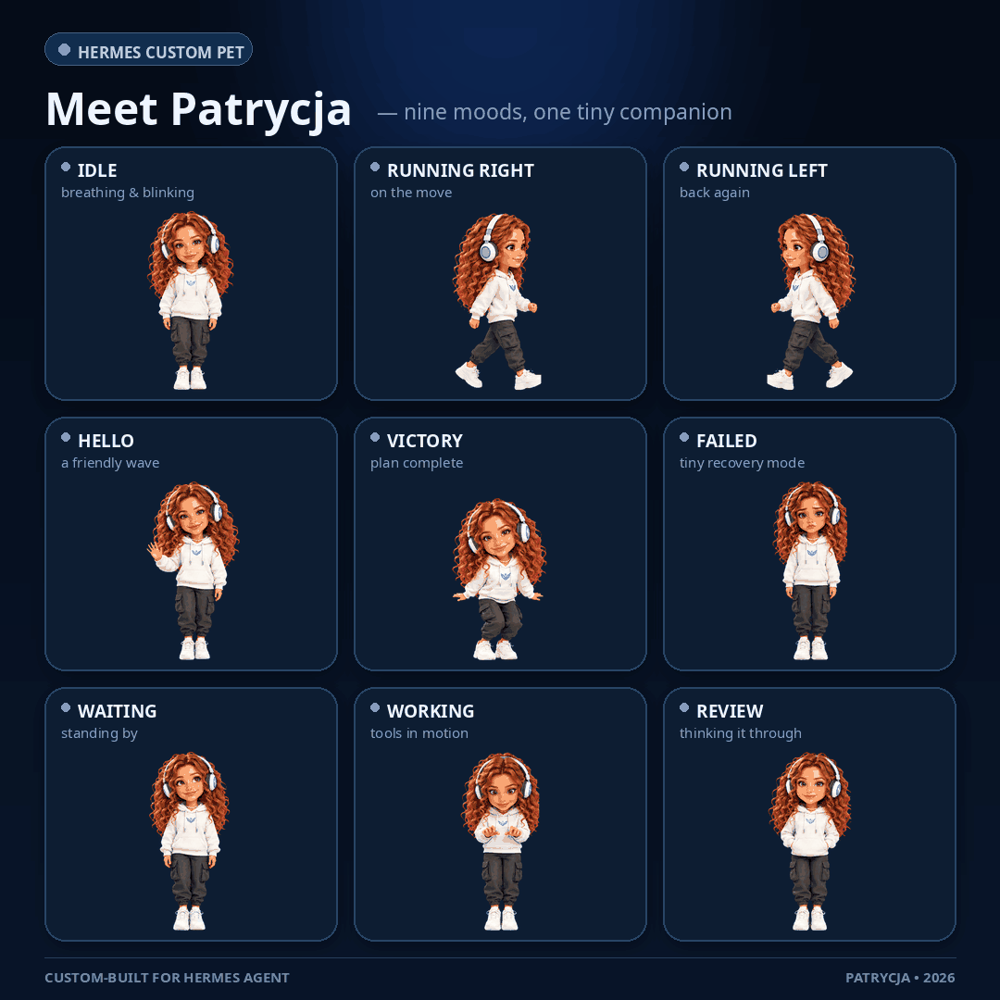

# Patrycja — animated mascot for Hermes Agent



Patrycja (affectionately **Patusia**) is an original animated desktop companion
for [Hermes Agent](https://github.com/NousResearch/hermes-agent). She reacts to
Hermes as it works: resting, running, reviewing, waiting, waving, jumping and
recovering from a failed action.

The package follows Hermes' Petdex-compatible 8×9 spritesheet format and works
in both Hermes Desktop and supported terminal renderers.

## Install

Hermes Agent **v0.21.1 or newer** is recommended.

```bash
hermes plugins install SebMaliszewski/patrycja-hermes-pet --enable
hermes gateway restart
hermes pets select patrycja
```

That is all. In Hermes Desktop, Patrycja can also be selected from
**Settings → Appearance → Pet** after the gateway restart.

Run the diagnostic if she does not appear:

```bash
hermes pets doctor
```

## Update

```bash
hermes plugins update patrycja_pet
hermes gateway restart
```

## Remove

Removing the plugin deliberately leaves the installed mascot in place, so an
update or accidental uninstall cannot delete a pet you are currently using.

```bash
hermes plugins remove patrycja_pet
hermes pets remove patrycja  # optional: also delete the mascot
```

## Animations

The production atlas contains all nine Hermes/Petdex rows:

| State | Frames | Behaviour |
|---|---:|---|
| Idle | 6 | Calm breathing and blinking |
| Running right | 8 | Moving across the workspace |
| Running left | 8 | Mirrored movement |
| Waving | 4 | Friendly greeting |
| Jumping | 5 | Success celebration |
| Failed | 8 | Reaction to an unsuccessful action |
| Waiting | 6 | Waiting for input or a result |
| Running | 6 | Working in place |
| Review | 6 | Focused reading and inspection |

The lossless WebP atlas is 1536×1872 pixels. Every cell is 192×208 pixels and
uses real transparency.

## What the plugin does

At gateway startup it verifies the bundled spritesheet's SHA-256 and copies
`pet.json` plus `spritesheet.webp` into:

```text
$HERMES_HOME/pets/patrycja/
```

It is intentionally narrow:

- no network requests;
- no credentials or environment secrets;
- no conversation access;
- no prompt, persona or model changes;
- no automatic replacement of an unrelated pet that already uses the
  `patrycja` slug.

The `on_session_start` hook only checks that the two public mascot assets are
still present. Installation is idempotent and uses atomic file replacement.

## Integrity

Production spritesheet SHA-256:

```text
37af1de78cffe721067d9495b710418484f2394bace0a08329ab9fbe56bfbd13
```

Showcase GIF SHA-256:

```text
d24e3794a125b53f47cabfb1b3098d05ef9721e87d34378b9b126fd31d3eea3b
```

## Credits and license

Patrycja was conceived by **Sebastian Maliszewski** and designed and produced
with **Kacper**, his AI collaborator. The character and animation assets are
original and AI-assisted.

Code and bundled artwork are released under the [MIT License](LICENSE), so you
may use, modify and redistribute them with the copyright notice preserved.

